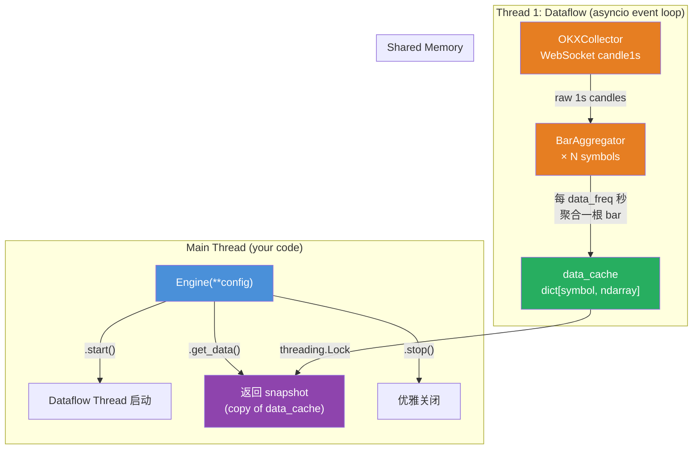
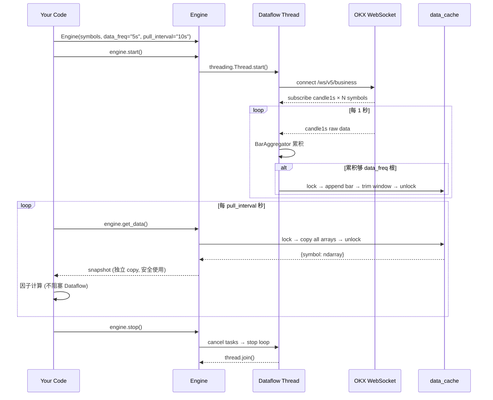
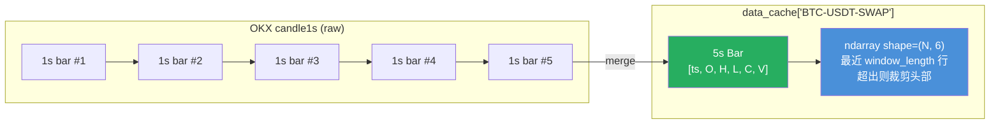

# FactorEngine Tutorial

## 目录

1. [系统概览](#1-系统概览)
2. [架构图](#2-架构图)
3. [组件详解](#3-组件详解)
4. [工作流（时序图）](#4-工作流时序图)
5. [数据聚合细节](#5-数据聚合细节)
6. [配置参数](#6-配置参数)
7. [Quick Start](#7-quick-start)
8. [API 参考](#8-api-参考)
9. [项目结构](#9-项目结构)

---

## 1. 系统概览

FactorEngine 是一个**实时因子计算系统**，用于 OKX 永续合约的量化交易。

核心设计思想：**两个线程 + 一个共享 cache**。

- **Dataflow 线程**：后台运行，连接 OKX WebSocket 订阅 candle1s，将 1s K线聚合成 N 秒 bar，写入共享 `data_cache`
- **主线程（你的代码）**：通过 `Engine.get_data()` 随时获取 cache 的快照，做因子计算

两者唯一的交互点是 `data_cache`（一个加锁的 dict），彼此完全解耦。

---

## 2. 架构图



**要点**：
- 蓝色 `Engine` 是你唯一需要交互的入口
- 橙色是 Dataflow 线程内部组件（你不需要关心）
- 绿色 `data_cache` 是共享数据，通过锁保证线程安全
- 紫色 `get_data()` 返回的是 **copy**，拿到后随便算，不阻塞数据采集

---

## 3. 组件详解

### 3.1 Engine (`factorengine/engine.py`)

**角色**：总入口，管理一切。

```python
engine = Engine(
    symbols=["BTC-USDT-SWAP", "ETH-USDT-SWAP"],
    data_freq="5s",        # 数据聚合频率
    pull_interval="10s",   # 因子计算拉取频率
    window_length=1000,    # cache 最大保留行数
)
```

| 方法 | 说明 |
|------|------|
| `start()` | 启动 Dataflow 线程，开始数据采集 |
| `stop()` | 优雅关闭，cancel 所有 task，join 线程 |
| `get_data()` | 返回全部 symbol 的 cache 快照 |
| `get_data(["BTC-USDT-SWAP"])` | 只返回指定 symbol |

`Engine` 内部创建了：
- `data_cache: dict[str, np.ndarray]` — 共享数据
- `threading.Lock` — 线程安全锁
- `Dataflow` 实例 — 管 Dataflow 线程

### 3.2 Dataflow (`dataflow/dataflow.py`)

**角色**：数据采集线程，你不需要直接接触它。

| 组件 | 说明 |
|------|------|
| `Dataflow` | 线程包装器，启动 asyncio event loop |
| `BarAggregator` | 每个 symbol 一个，累积 1s candle，聚合成 N 秒 bar |

Dataflow 的工作流：
1. 启动后创建 asyncio event loop（在独立线程中）
2. 创建 `OKXCollector`，开始 WebSocket 订阅
3. 收到 candle1s → 交给对应 symbol 的 `BarAggregator`
4. 聚合够 `data_freq` 根后 → 加锁 → 写入 `data_cache` → 解锁
5. 如果 cache 行数超过 `window_length`，裁剪头部

### 3.3 OKXCollector (`dataflow/collector.py`)

**角色**：OKX WebSocket 连接管理。

| 功能 | 说明 |
|------|------|
| 自动分片 | 304 symbols → 200+104，两条 WS 连接（OKX 限制 480/连接） |
| 自动重连 | 断线后 3s 重连，异常后 5s 重连 |
| Endpoint | `/ws/v5/business`（candle 数据走 business 端点，不是 public） |
| 数据解析 | 将 OKX 的 list 格式包装成 `{"instId": str, "raw": list}` |

### 3.4 data_cache（共享内存）

```python
data_cache: dict[str, np.ndarray]
# key: symbol (e.g. "BTC-USDT-SWAP")
# value: ndarray shape=(N, 6)
#   列: [ts, open, high, low, close, vol]
#   N: 当前累积的 bar 数量, 最大 window_length
```

线程安全：
- **Dataflow 线程写**：每次聚合完一根 bar，`lock → vstack → trim → unlock`
- **主线程读**：`get_data()` 执行 `lock → copy → unlock`
- 持锁时间极短（< 0.5ms），不会互相阻塞

---

## 4. 工作流（时序图）



**关键点**：
1. Dataflow 线程 **持续写** cache（每秒都在收数据）
2. 你的代码按 `pull_interval` **定期读** cache（每次拿到的是最新快照）
3. 两者通过锁隔离，互不阻塞
4. `get_data()` 返回的是 **深拷贝**，之后随便改，不影响 cache

---

## 5. 数据聚合细节



聚合规则（以 `data_freq="5s"` 为例）：

| 字段 | 聚合方式 |
|------|---------|
| ts | 第 1 根 1s bar 的时间戳 |
| open | 第 1 根 1s bar 的 open |
| high | 5 根中的 max(high) |
| low | 5 根中的 min(low) |
| close | 第 5 根 1s bar 的 close |
| vol | 5 根的 sum(vol) |

滚动窗口：当 `data_cache[symbol]` 的行数超过 `window_length`，从头部裁掉旧数据。

---

## 6. 配置参数

### Engine 构造参数

| 参数 | 类型 | 默认值 | 说明 |
|------|------|--------|------|
| `symbols` | `list[str]` | 必填 | 订阅的合约列表 |
| `data_freq` | `str` | `"5s"` | Dataflow 聚合频率。每隔多少秒生成一根 bar |
| `pull_interval` | `str` | `"10s"` | FactorEngine 拉取频率。暴露为 `engine.pull_interval_seconds` |
| `window_length` | `int` | `1000` | cache 最大保留行数。超出后裁剪头部 |

### 频率格式

支持任意组合：

| 格式 | 转换 | 示例 |
|------|------|------|
| `Ns` | N 秒 | `1s`, `5s`, `10s`, `30s` |
| `Nm` / `Nmin` | N 分钟 | `1m`, `1min`, `5min` |
| `Nh` / `Nhr` | N 小时 | `1h`, `1hr` |

```python
# 快线：1s 聚合，每 5s 拉一次
engine = Engine(symbols, data_freq="1s", pull_interval="5s")

# 标准：5s 聚合，每 10s 拉一次
engine = Engine(symbols, data_freq="5s", pull_interval="10s")

# 慢线：1min 聚合，每 5min 拉一次
engine = Engine(symbols, data_freq="1min", pull_interval="5min")
```

---

## 7. Quick Start

### 最小示例

```python
from factorengine.engine import Engine

engine = Engine(
    symbols=["BTC-USDT-SWAP", "ETH-USDT-SWAP"],
    data_freq="5s",
    pull_interval="10s",
)
engine.start()

# 每 10 秒拉取一次数据
import time
while True:
    time.sleep(engine.pull_interval_seconds)
    snapshot = engine.get_data()
    for symbol, data in snapshot.items():
        # data 是 ndarray, shape=(N, 6), 列=[ts, open, high, low, close, vol]
        print(f"{symbol}: {data.shape}, latest_close={data[-1, 4]:.2f}")
```

### 只拉特定 symbol

```python
snapshot = engine.get_data(["BTC-USDT-SWAP"])
btc_data = snapshot["BTC-USDT-SWAP"]  # ndarray (N, 6)
```

### 全市场（304 个合约）

```python
import asyncio, aiohttp
from dataflow.collector import fetch_all_swap_symbols

async def fetch():
    async with aiohttp.ClientSession() as s:
        return await fetch_all_swap_symbols(s)

symbols = asyncio.run(fetch())  # ~304 symbols
engine = Engine(symbols=symbols, data_freq="5s", pull_interval="10s")
engine.start()
```

### 运行测试脚本

```bash
cd FactorEngine

# 指定 symbol
python -m tests.test_live BTC-USDT-SWAP ETH-USDT-SWAP

# 全市场
python -m tests.test_live
```

---

## 8. API 参考

### `Engine.__init__(symbols, data_freq, pull_interval, window_length)`

创建 Engine 实例。不启动任何线程。

### `Engine.start() -> None`

启动 Dataflow 线程，开始 WebSocket 数据采集。

### `Engine.stop() -> None`

优雅关闭：cancel 所有 asyncio task，关闭 WebSocket 连接，join 线程。

### `Engine.get_data(symbols=None) -> dict[str, np.ndarray]`

获取 data_cache 的快照（深拷贝）。

- `symbols=None`：返回所有 symbol
- `symbols=["BTC-USDT-SWAP"]`：只返回指定 symbol
- 返回值：`{symbol: ndarray(N, 6)}`，列 = `[ts, open, high, low, close, vol]`
- 线程安全，持锁 < 0.5ms

### `Engine.bar_count -> int`

截至当前已聚合的 bar 总数。

### `Engine.data_freq_seconds -> int`

`data_freq` 解析后的秒数。

### `Engine.pull_interval_seconds -> int`

`pull_interval` 解析后的秒数。

---

## 9. 项目结构

```
FactorEngine/
  dataflow/
    __init__.py
    collector.py      # OKX WebSocket 连接 + candle1s 订阅
    dataflow.py       # Dataflow 线程 + BarAggregator + cache 写入
  factorengine/
    __init__.py
    engine.py         # Engine 入口 + get_data() + parse_freq()
  tests/
    test_live.py      # 测试脚本 (while loop 每 N 秒 pull)
  docs/
    20260404/
      architecture_design.md   # 架构设计文档
      test_report.md           # 压测报告
      tutorial.md              # ← 本文档
```

| 文件 | 行数 | 职责 |
|------|------|------|
| `collector.py` | ~90 | WebSocket 连接、订阅、分片、重连 |
| `dataflow.py` | ~150 | 线程管理、1s→Ns 聚合、cache 写入 |
| `engine.py` | ~95 | 入口类、频率解析、get_data() |
| `test_live.py` | ~80 | 测试用 while loop |

**Total**: ~415 行代码，零外部依赖（仅 `aiohttp` + `numpy`）。
