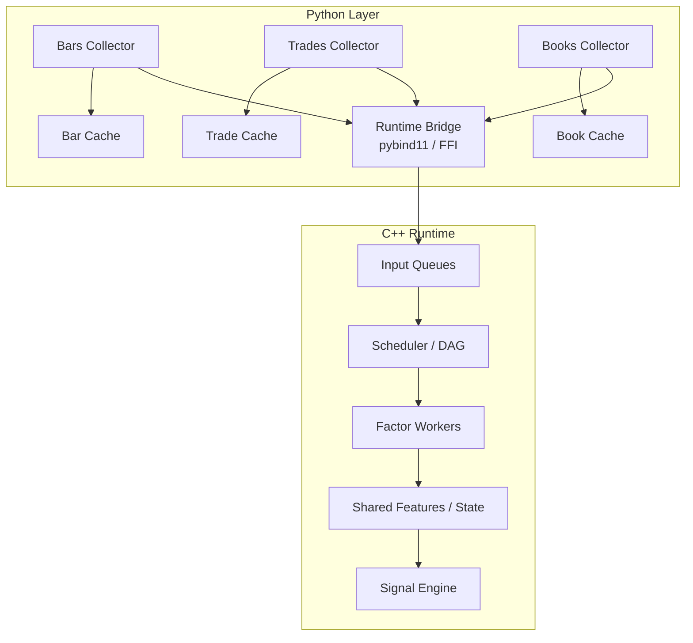

# FactorEngine 重构设计文档（2026-04-06）

## 1. 背景

当前版本的 FactorEngine 以 `candle1s -> N 秒 bar -> shared data_cache -> Python pull snapshot` 为核心路径。

这条路径对纯 OHLCV 因子是够用的，但当系统目标扩展为：

- 同时消费 `OHLCV`、`trades`、`order book`
- 支持多个异构因子表达式
- 支持分钟级甚至更高频的时序因子
- 支持低延迟、可并行、可扩展的因子运行时

当前架构会遇到几个根本问题：

1. Python 热路径同时承担采集、缓存、聚合、计算，职责边界不清晰。
2. `get_data()` 轮询式拉取快照会导致重复扫描和不必要的数据复制。
3. 只有单一路径 `bar cache`，无法自然容纳 `trade` / `book` 级别输入。
4. 因子一旦变多，靠 Python 多线程硬顶会很快遇到 GIL、调度和内存访问问题。
5. 因子之间共享中间量时，按“每个因子独立线程”扩展会造成大量重复计算。

因此，本次重构的目标不是在现有 Python 代码上继续堆功能，而是重新明确系统分层：

- Python 负责数据接入和系统编排
- C++ 负责因子计算热路径
- `bars`、`trades`、`books` 三类数据分开采集、分开缓存
- 数据接入采用事件驱动，因子评估采用受控的定时调度和任务调度，而不是忙等式 cache 轮询和“每因子一线程”

---

## 2. 设计目标

### 2.1 目标

1. 支持三类输入流：
   - `bars`
   - `trades`
   - `books`
2. 支持不同因子声明自己的输入依赖和触发时机。
3. 将因子计算热路径迁移到 C++。
4. 保留 Python 作为采集层、调试层、测试层和配置层。
5. 支持按 symbol 扩展、按 worker 扩展，而不是按因子线程数扩展。
6. 为未来支持回放、重演、离线回测保留接口。

### 2.2 非目标

1. 本阶段不直接实现完整交易执行系统。
2. 本阶段不要求一次性上增量 L2 order book。
3. 本阶段不要求立即移除现有 Python bar 聚合路径。
4. 本阶段不要求所有因子都立刻迁移到 C++。

---

## 3. 核心决策

### 决策 1：数据接入层保留 Python

理由：

- WebSocket 接入、协议解析、测试脚本、快速试错在 Python 中开发效率更高。
- 现有 `aiohttp` / `asyncio` 路径已经可用，适合作为接入层继续扩展。
- 采集侧主要是 I/O bound，Python 并不是瓶颈的第一来源。

### 决策 2：因子运行时迁移到 C++

理由：

- 多输入、多窗口、多因子叠加后，热路径会变成 CPU bound。
- C++ 更适合做 ring buffer、窗口计算、共享中间量、固定 worker 调度。
- 对低延迟和确定性更友好。

### 决策 3：`bars` / `trades` / `books` 分三路采集，三路独立 cache

理由：

- 三类数据的频率、结构、语义完全不同。
- `bars` 是聚合后时间序列，`trades` 是事件流，`books` 是快照/事件流。
- 硬塞进一个 `data_cache` 会导致结构混乱、锁竞争和使用方误解。

### 决策 4：Dataflow 只做“接入、接入级标准化、缓存”，不做因子级加工

边界如下：

- `bars`：允许在 Dataflow 内继续做基础聚合，如 `1s -> 5s/1m`
- `trades`：保留原始 trade / trades-all 事件，只做接入级标准化，不做因子级聚合
- `books`：保留接入级标准化后的浅簿或深簿数据，不做因子级聚合

这里的“接入级标准化”只包括：

- 协议适配
- 字段名对齐
- `symbol`、`channel`、`ts_event`、`ts_recv` 等元数据补齐
- 基础类型转换
- bar 的必要基础聚合

这里明确不包括：

- VWAP
- imbalance
- microprice
- 大单统计
- 分钟级窗口聚合
- 跨流对齐后的表达式计算

换句话说，Dataflow 只负责把数据“正确送达”，不负责决定“怎么算因子”。

### 决策 5：不采用“每个因子一个线程”

这是本次重构中最重要的负面决策之一。

原因：

1. 因子数增长后线程数不可控。
2. 多个因子会重复读取同一 symbol、同一窗口、同一中间量。
3. 线程调度和锁竞争开销高。
4. cache locality 很差。
5. 时间对齐和依赖顺序难控制。

替代方案：

- 固定大小 worker pool
- 按 symbol shard 或 stream shard 调度
- 因子以任务节点的形式挂在运行时 DAG 上

### 决策 6：不采用“FactorEngine 忙等式不停轮询 data_cache”，采用定时评估调度

原因：

- 无新数据时会空转
- 新数据到达后依然存在延迟
- 会造成重复 copy 和重复扫描
- 不利于 trade/book 级别事件驱动因子

替代方案：

- Dataflow 持续接收新事件并更新 cache / 输入队列
- Factor runtime 由 timer scheduler 按固定频率触发评估，例如 `1s`、`5s`、`10s`
- 每次评估时，worker pool 负责把该时刻所需的全部因子算完
- 对少数必须事件驱动的因子，运行时仍可额外支持 `on_trade` / `on_book` 触发

这里需要明确区分两种模式：

1. 不推荐：忙等式轮询
   - 因子线程反复 `get_data()`
   - 不管有没有新数据都持续扫描 cache

2. 推荐：受控定时评估
   - Dataflow 持续采集
   - Runtime 在固定 evaluation tick 上读取所需窗口并统一计算
   - 例如每 `10s` 输出一次完整 factor snapshot 供下游模型使用

---

## 4. 目标架构



### 分层解释

#### Python Layer

- 负责交易所接入
- 负责协议解析和接入级标准化
- 负责基础 cache
- 负责运行时调试、测试和观测
- 不负责因子热路径计算

#### C++ Runtime

- 负责事件接收
- 负责调度和依赖管理
- 负责窗口状态维护
- 负责因子计算
- 负责信号产出

默认工作模式：

- 接入侧事件驱动
- 评估侧 timer-driven
- 必要时保留部分事件触发型因子

---

## 5. 数据通道设计

### 5.1 Bars 通道

输入来源：

- OKX `candle1s`

Dataflow 职责：

- 接收原始 1s candle
- 做基础 bar 聚合
- 写入 `BarCache`
- 将“bar close event”推给 runtime

适合依赖：

- 只依赖 `open/high/low/close/volume`
- 低频或中频时间序列因子

### 5.2 Trades 通道

输入来源：

- OKX `trades`
- 优先考虑 OKX `trades-all`

Dataflow 职责：

- 接收原始成交事件
- 做接入级标准化
- 写入 `TradeCache`
- 将 trade event 推给 runtime

原则：

- 不在 Dataflow 做分钟因子聚合
- 不在 Dataflow 做 buy/sell imbalance 等因子逻辑
- 所有窗口计算由 runtime 负责

### 5.3 Books 通道

输入来源：

- 初期可从 `books5` 开始
- 后续按需要升级到增量 order book

Dataflow 职责：

- 接收书本更新
- 做接入级标准化并转成统一 book schema
- 写入 `BookCache`
- 将 book event 推给 runtime

原则：

- 初期以浅簿为主，优先满足 L1/L5 因子
- 深簿和增量恢复单独设计，不在第一阶段强行引入

---

## 6. Cache 设计

三类 cache 彼此独立：

```text
BarCache[symbol]
TradeCache[symbol]
BookCache[symbol]
```

### 6.1 BarCache

建议结构：

```text
ring buffer of BarEvent
```

字段：

- `ts_event`
- `ts_recv`
- `open`
- `high`
- `low`
- `close`
- `vol`
- 可选：`vol_ccy`
- 可选：`vol_ccy_quote`

### 6.2 TradeCache

建议结构：

```text
ring buffer of TradeEvent
```

字段：

- `ts_event`
- `ts_recv`
- `px`
- `sz`
- `side`
- `trade_id`
- `is_aggregated`
- `count`

说明：

- 若使用 `trades-all`，`is_aggregated = false`
- 若使用 `trades`，`is_aggregated = true`

### 6.3 BookCache

建议结构：

```text
latest snapshot + short ring buffer of BookEvent
```

字段建议：

- `ts_event`
- `ts_recv`
- `best_bid_px`
- `best_bid_sz`
- `best_ask_px`
- `best_ask_sz`
- `spread`
- `mid`
- `levels_bid[5]`
- `levels_ask[5]`

### 6.4 Cache 设计原则

1. 采集层 cache 主要服务于：
   - 调试
   - 快速回看
   - 诊断
   - 回放接口
2. 运行时不应该依赖频繁深拷贝这些 cache。
3. 运行时应该消费事件队列，并在 C++ 内维护自己的状态和窗口。
4. 默认不需要对采集层 cache 做高频深拷贝轮询，而是在 evaluation tick 时读取所需窗口。

---

## 7. Runtime 输入模型

推荐用统一事件结构进入 C++ runtime：

```text
Event =
  BarEvent
  TradeEvent
  BookEvent
  TimerEvent
```

每个事件至少带两种时间：

- `ts_event`：交易所事件时间
- `ts_recv`：本机接收时间

这样后续可以同时支持：

- 事件时间对齐
- 网络延迟观测
- 排序和补偿策略

---

## 8. 因子声明模型

因子不应只是一段 Python 函数，而应是一个声明了自身依赖和触发方式的节点。

建议每个因子声明：

1. `inputs`
2. `trigger`
3. `window`
4. `output cadence`

例如：

```text
Factor: return_1m
inputs: bars
trigger: on_bar_close(1m)
window: 60 bars
```

```text
Factor: trade_imbalance_1m
inputs: trades
trigger: every_1s
window: 60s
```

```text
Factor: microprice_deviation
inputs: books
trigger: on_book
window: latest snapshot
```

```text
Factor: trade_book_pressure
inputs: trades + books
trigger: every_1s
window: 5s trades + latest book
```

### 因子触发类型

建议支持四类：

1. `on_bar_close`
2. `on_trade`
3. `on_book`
4. `on_timer`

其中推荐的默认模式是：

- 大部分生产因子使用 `on_timer`
- 只有少数确实要求事件级响应的因子使用 `on_trade` / `on_book`

这样既能保留高频扩展能力，也能匹配“定时向下游模型输出 factor snapshot”的主工作流。

---

## 9. 调度模型

### 9.1 不推荐方案：每个因子一个线程

不推荐原因已在前文说明，这里不再重复。

### 9.2 推荐方案：固定 worker + 任务图

核心思路：

- 运行时内部存在一个 timer scheduler，用于产生 evaluation tick
- 运行时内部维护固定数量 worker
- 每个 worker 负责一组 symbol shard 或任务分片
- 在每个 evaluation tick 上，只计算该时刻所需的节点
- 对事件型因子，再按需补充事件触发任务

可以理解为：

```text
event arrival
-> update runtime state

evaluation tick
-> dependency lookup
-> task enqueue
-> worker execute
-> update factor value / signal snapshot
```

### 9.3 优先并行维度

优先级建议：

1. 按 `symbol shard` 并行
2. 按 `stream partition` 并行
3. 再考虑部分重计算任务并行

不建议优先按“因子 ID”并行。

### 9.4 定时评估的推荐模型

假设系统设定：

```text
evaluation_interval = 10s
```

则运行方式建议为：

1. `0s ~ 10s`
   - Dataflow 持续采集 `bars` / `trades` / `books`
   - Runtime 持续更新内部状态和 ring buffer
2. 到 `10s`
   - scheduler 发出 evaluation tick
3. 在该 tick 上
   - worker pool 并行计算该时刻所需的全部因子
4. 计算完成后
   - 生成该时刻的 factor snapshot
   - 输出给下游模型或信号层

这个模式的关键点是：

- 采集不停
- 计算按频率触发
- 线程池负责在一个 evaluation window 内完成所有目标因子

### 9.5 共享中间量

很多因子会共享中间结果，例如：

- `mid`
- `spread`
- `book imbalance`
- `trade imbalance`
- `vwap_1m`
- `realized volatility`

这些应由 runtime 统一维护，而不是每个因子自己重复算。

---

## 10. 为什么 Dataflow 不应负责 trades/book 聚合

原因不是“做不到”，而是职责不对。

如果 Dataflow 开始负责：

- 1 分钟成交量不平衡
- 30 秒 VWAP
- 10 秒订单簿压力
- 过去 50 笔成交方向比

那么 Dataflow 就会变成半个因子引擎，最终导致：

1. 数据层和计算层耦合
2. 新因子需求会不断侵入采集层
3. 同一个原始流被多次、分散、不可控地加工
4. 无法统一调度和共享中间量

因此边界必须保持清晰：

- Dataflow：只做接入级标准化和必要基础聚合
- Factor Runtime：负责窗口和表达式

---

## 11. 关于 `bars` 是否保留现有聚合逻辑

建议：保留，但只把它视为一种基础数据通道。

也就是说：

- 现有 `1s -> 5s bar` 聚合逻辑可以继续存在
- 它只服务于 bar 类因子
- 它不应该成为整个系统唯一的数据抽象

长期来看，bar、trade、book 三路应处于同等地位。

---

## 12. Python 与 C++ 的边界建议

### 12.1 Python 负责

- 配置加载
- collector 生命周期
- 交易所接入
- 接入级标准化
- 测试脚本
- 落盘和调试
- runtime 启停控制

### 12.2 C++ 负责

- ring buffer
- 窗口状态
- 调度器
- 因子 DAG
- 共享中间量
- 因子计算
- 信号生成

### 12.3 Python/C++ 交互建议

优先考虑：

- `pybind11` 暴露 runtime API

接口形态建议：

```text
push_bar(symbol, event)
push_trade(symbol, event)
push_book(symbol, event)
poll_signals()
query_factor(symbol, factor_id)
```

这样 Python 仍然像“控制平面”，C++ 像“数据平面”。

---

## 13. 因子示例

### 13.1 纯 OHLCV 因子

输入：

- `bars`

示例：

- return
- volatility
- moving average
- ATR

触发：

- `on_bar_close`

### 13.2 基于 trades 的分钟级时序因子

输入：

- `trades-all`

示例：

- 过去 1 分钟主动买成交量占比
- 过去 1 分钟成交笔数
- 过去 1 分钟大单占比
- 过去 1 分钟 VWAP 偏离

触发：

- `every_1s` 或 `on_timer(1s)`

说明：

- 输入是 tick / trade 事件
- 输出完全可以是 1 分钟级时间序列

### 13.3 基于 books 的盘口因子

输入：

- `books5`

示例：

- spread
- mid price
- L1 imbalance
- top-5 imbalance

触发：

- `on_book`

### 13.4 跨流因子

输入：

- `trades + books`

示例：

- trade flow 对盘口冲击
- microprice 偏离
- aggressive buy/sell 和盘口失衡耦合

触发：

- `on_trade` 或 `every_1s`

---

## 14. 推荐迁移路线

### Phase 1：扩展 Python Dataflow

目标：

- 新增 `trades` collector
- 新增 `books` collector
- 三类 cache 独立
- 完成测试脚本和数据验证

交付物：

- `bars` / `trades` / `books` 三路 live test
- cache schema 文档

### Phase 2：统一内部事件模型

目标：

- 明确 `BarEvent` / `TradeEvent` / `BookEvent`
- 明确时间字段
- 明确 symbol 分片策略

交付物：

- Python 侧统一事件 schema
- 运行时桥接接口草案

### Phase 3：引入 C++ runtime MVP

目标：

- 建立 pybind11 桥接
- 支持 push 三类事件
- 支持少量基础因子
- 支持信号输出

交付物：

- C++ runtime skeleton
- 至少 2-3 个示例因子

### Phase 4：迁移核心因子

目标：

- 将 CPU 热点因子迁入 C++
- 引入共享中间量和调度优化

交付物：

- 基础因子库
- scheduler / worker pool

### Phase 5：收缩 Python 热路径职责

目标：

- Python 只保留采集、控制、测试、运维观测
- 计算热路径完全由 C++ 接管

---

## 15. 风险与待确认问题

### 15.1 books5 够不够

短期：

- 对 L1/L5 因子够用

中长期：

- 如果要更细盘口冲击或撤单行为分析，可能需要更深 order book 或增量簿

### 15.2 stream 对齐策略

需要明确：

- 因子按 `event time` 还是 `receive time` 驱动
- trade/book/bar 跨流如何对齐
- 延迟和乱序如何处理

### 15.3 背压策略

需要明确：

- 当事件流突增时，队列满了怎么办
- 丢旧数据还是丢新数据
- 是否允许按 symbol 降级

### 15.4 回放与复现

若后续要做：

- 线上问题复现
- 因子回放
- 离线诊断

则需要尽早规划统一事件落盘格式。

---

## 16. 最终建议

本项目下一阶段的正确方向不是继续把 Python `Engine.get_data()` 包装得更复杂，而是正式把系统拆成：

1. Python Dataflow
   - 负责 `bars` / `trades` / `books` 采集
   - 负责接入级标准化和 cache

2. C++ Factor Runtime
   - 负责定时评估调度
   - 负责窗口状态
   - 负责因子计算
   - 负责信号生成
   - 必要时支持少量事件触发型因子

3. Python Control Plane
   - 负责配置、测试、调试、启动、监控

本次重构中最应该坚持的三条原则是：

1. `Dataflow` 不做因子级加工或窗口聚合。
2. `Factor runtime` 不做忙等式 cache 轮询，而是以定时评估为主、事件触发为辅。
3. 不使用“每个因子一个线程”，而使用固定 worker + 任务图调度。

如果后续按这个方向推进，现有系统可以自然演进为一个真正可扩展的多输入因子引擎，而不是一个只适合 OHLCV 拉快照的 Python 原型。
