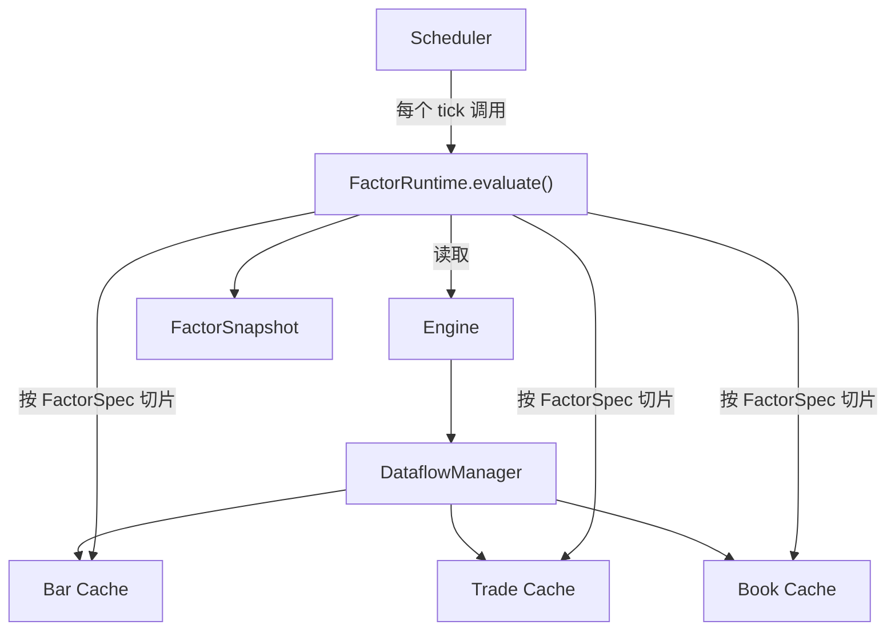
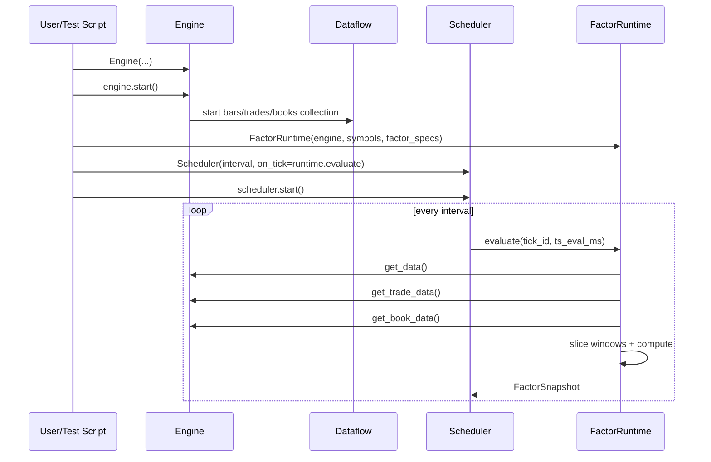

# Scheduler 模块教程（2026-04-07）

## 1. 这份教程讲什么

这份文档专门解释当前 `factorengine/scheduler/` 这个模块。

重点回答：

1. 这个模块里有哪些文件
2. 每个文件分别做什么
3. 整个流程是怎么跑起来的
4. 现在这版原型该怎么用

这是一份**结合当前代码**的教程，不是抽象设计稿。

---

## 2. 当前模块结构

当前 scheduler 原型代码在：

- [factorengine/scheduler](/home/ubuntu/workspace/FactorEngine/factorengine/scheduler)

里面包含：

- [__init__.py](/home/ubuntu/workspace/FactorEngine/factorengine/scheduler/__init__.py)
- [factor_spec.py](/home/ubuntu/workspace/FactorEngine/factorengine/scheduler/factor_spec.py)
- [factor_snapshot.py](/home/ubuntu/workspace/FactorEngine/factorengine/scheduler/factor_snapshot.py)
- [runtime.py](/home/ubuntu/workspace/FactorEngine/factorengine/scheduler/runtime.py)
- [scheduler.py](/home/ubuntu/workspace/FactorEngine/factorengine/scheduler/scheduler.py)

对应一个 live 测试脚本：

- [test_scheduler_live.py](/home/ubuntu/workspace/FactorEngine/tests/test_scheduler_live.py)

---

## 3. 一张图先看全貌



这张图可以直接理解成：

- `Engine` 提供 dataflow 和三路 cache
- `Scheduler` 定时发起 tick
- `FactorRuntime` 在 tick 上读取 cache、切片、计算
- 最后产出 `FactorSnapshot`

---

## 4. 模块里的每个文件干什么

## 4.1 `factor_spec.py`

文件：

- [factor_spec.py](/home/ubuntu/workspace/FactorEngine/factorengine/scheduler/factor_spec.py)

作用：

- 定义“一个因子怎么描述”

当前类：

- `FactorSpec`

它描述的是：

- 因子名字
- 因子依赖的数据来源
- 因子需要多大的窗口
- 因子计算函数是谁

### 例子

```python
FactorSpec(
    name="trade_imbalance_500",
    source="trades",
    window=500,
    compute_fn=compute_trade_imbalance,
)
```

这个例子表示：

- 因子名叫 `trade_imbalance_500`
- 用 `trades` 数据
- 取最近 `500` 条
- 用 `compute_trade_imbalance()` 去算

### 为什么需要它

因为 runtime 不能把每个因子都写死在 `if/else` 里。  
`FactorSpec` 的作用就是把“怎么取数据、怎么计算”这件事变成可配置对象。

---

## 4.2 `factor_snapshot.py`

文件：

- [factor_snapshot.py](/home/ubuntu/workspace/FactorEngine/factorengine/scheduler/factor_snapshot.py)

作用：

- 定义“一轮 evaluation 结束后产出的结果”

当前类：

- `FactorSnapshot`

它包含：

- `tick_id`
- `ts_eval_ms`
- `duration_ms`
- `values`

其中 `values` 结构是：

```python
dict[symbol, dict[factor_name, float]]
```

### 例子

```python
{
    "BTC-USDT-SWAP": {
        "bar_momentum_20": 0.0012,
        "trade_imbalance_500": -0.032,
        "book_l1_imbalance_50": 0.441,
    }
}
```

这表示：

- 在某次 tick 上
- 对某个 symbol
- 算出了若干个因子值

---

## 4.3 `runtime.py`

文件：

- [runtime.py](/home/ubuntu/workspace/FactorEngine/factorengine/scheduler/runtime.py)

作用：

- 这是 scheduler 子系统里真正“干活”的核心文件

当前类：

- `FactorRuntime`

当前函数：

- `compute_bar_momentum`
- `compute_trade_imbalance`
- `compute_book_l1_imbalance`
- `compute_book_l5_imbalance`

### `FactorRuntime` 做什么

每次调用：

```python
runtime.evaluate(tick_id, ts_eval_ms)
```

它会：

1. 从 `engine` 拉当前 snapshots
2. 按 `FactorSpec` 做 slicing
3. 调用对应 `compute_fn`
4. 汇总成一个 `FactorSnapshot`

### 它里面最重要的逻辑

#### `_fetch_snapshots()`

只读取当前 factor specs 真正依赖的那几路数据。

例如：

- 如果因子只依赖 `bars + trades`
- 它就不会去拉 `books`

#### `_slice_window()`

这是最核心的 slicing 入口。

比如：

- 最近 20 根 bars
- 最近 500 笔 trades
- 最近 50 次 books

都会在这里完成切片。

### 例子

如果某个 spec 是：

```python
FactorSpec("bar_momentum_20", "bars", 20, compute_bar_momentum)
```

那么 runtime 会做：

```python
raw = snapshots["bars"].get(symbol)
window = raw[-20:]
value = compute_bar_momentum(window)
```

---

## 4.4 `scheduler.py`

文件：

- [scheduler.py](/home/ubuntu/workspace/FactorEngine/factorengine/scheduler/scheduler.py)

作用：

- 控制定时 tick

当前类：

- `Scheduler`

它本身不算因子，只做一件事：

```text
每隔固定时间调用一次 on_tick
```

### 当前行为

你给它：

- `interval_seconds`
- `on_tick`

它就在独立线程里循环：

1. 等待 interval
2. 生成 `tick_id`
3. 生成 `ts_eval_ms`
4. 调 `on_tick(tick_id, ts_eval_ms)`

### 一句话

- `Scheduler` = 敲钟的人
- `FactorRuntime` = 干活的人

---

## 5. 这几个模块是怎么串起来的

下面是完整时序：



这张图里最关键的一点是：

**Scheduler 不直接碰 dataflow，Scheduler 只调 Runtime。**

---

## 6. 现在这版原型怎么用

最直接的例子就是：

- [test_scheduler_live.py](/home/ubuntu/workspace/FactorEngine/tests/test_scheduler_live.py)

这个脚本做了这些事：

1. 创建 `Engine`
2. 启动 dataflow
3. 定义几个 `FactorSpec`
4. 创建 `FactorRuntime`
5. 创建 `Scheduler`
6. 每个 tick 打印一轮 `FactorSnapshot`

### 当前默认因子

它现在挂了 3 个示例因子：

- `bar_momentum_20`
- `trade_imbalance_500`
- `book_l1_imbalance_50`

### 运行方式

```bash
cd /home/ubuntu/workspace/FactorEngine
python -m tests.test_scheduler_live
```

或者全市场：

```bash
python -m tests.test_scheduler_live --all --sample-limit 5
```

### 你会看到什么

每个 tick 大致会打印：

```text
tick_id=1 ts_eval=... duration_ms=...
symbols=...
BTC-USDT-SWAP: bar_momentum_20=... trade_imbalance_500=... book_l1_imbalance_50=...
```

这说明 scheduler 已经把：

- 定时触发
- slicing
- 计算
- snapshot 输出

这条链路跑起来了。

---

## 7. 当前这版原型的优点

### 7.1 边界清晰

- `Engine` 管 dataflow
- `Scheduler` 管 tick
- `FactorRuntime` 管 slicing + compute

### 7.2 不过度设计

现在还没有：

- DAG
- 注册系统
- worker pool
- C++ bridge

这很好，因为当前真正要验证的只是：

```text
定时调度 -> cache slicing -> factor output
```

### 7.3 容易迁移到 C++

因为现在 runtime 的输入输出已经很清楚：

- 输入：数组化 cache
- 输出：factor snapshot

这正是未来 C++ runtime 最需要的边界。

---

## 8. 当前这版原型的局限

### 8.1 还是同步计算

每个 tick 的所有因子目前都在同一个 evaluate 调用里同步完成。

### 8.2 没有多频率

现在一个 Scheduler 只有一个 interval。

### 8.3 没有跨源因子

`FactorSpec` 目前只支持单一 `source`。

### 8.4 没有任务并行

还没有 worker pool。

这些都不是 bug，而是**第一版刻意没做**。

---

## 9. 你现在看代码时，最该抓住的主线

如果你要快速理解这整个模块，建议只抓住下面这条主线：

1. `FactorSpec`
   定义“这个因子用什么数据、取多少窗口”
2. `FactorRuntime.evaluate()`
   真正读取 snapshot、切窗口、计算
3. `Scheduler`
   定时调用 `evaluate()`
4. `FactorSnapshot`
   保存结果

一句话：

```text
spec 决定算什么
runtime 决定怎么算
scheduler 决定什么时候算
snapshot 保存算出来的结果
```

---

## 10. 下一步可以往哪里扩展

这版原型跑通后，下一步最自然的扩展方向有三个：

### 10.1 增加更多示例因子

例如：

- `book_l5_imbalance_50`
- `trade_vwap_500`
- `bar_volatility_20`

### 10.2 支持多源因子

例如：

- bars + trades
- trades + books

### 10.3 引入 worker pool

等因子和 symbol 规模上来后，再讨论并行执行。

---

## 11. 总结

当前 `factorengine/scheduler/` 这个模块，本质上就是一个**最小可运行的因子调度原型**。

它已经实现了：

- 定时 tick
- 从 dataflow 读取数组
- 按窗口切片
- 计算示例因子
- 输出 factor snapshot

这版代码不是最终形态，但它已经把后续最关键的边界跑通了。
