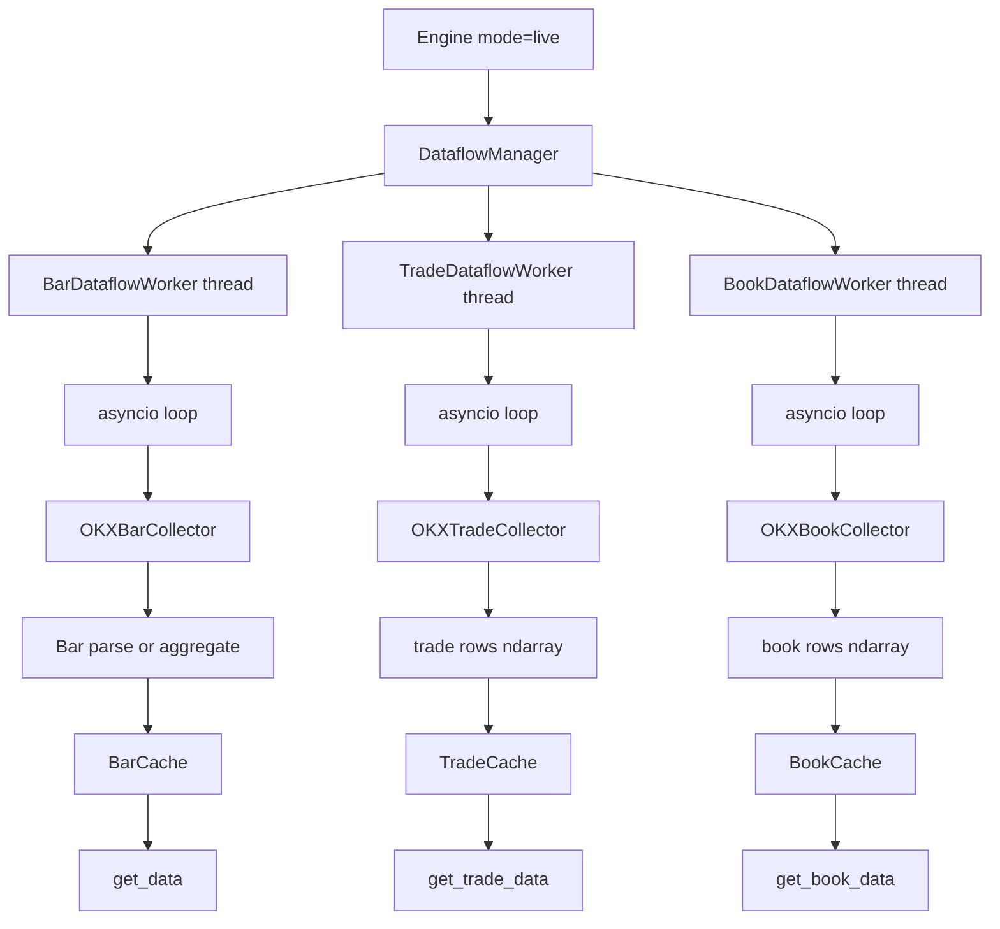
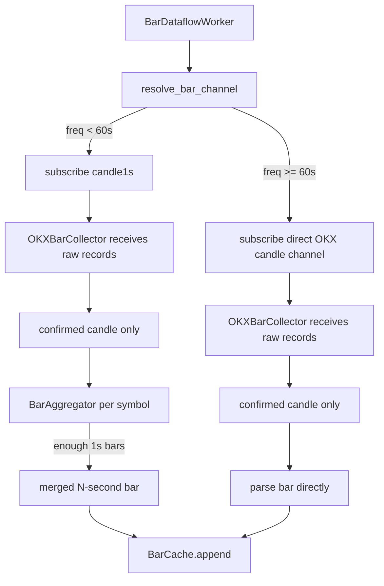
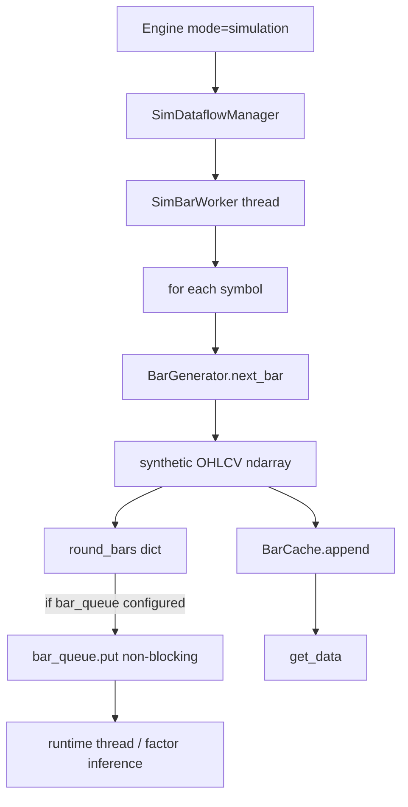
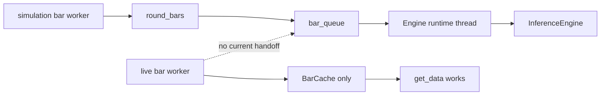

# `dataflow/livetrading` vs `dataflow/simulation`

> Date: 2026-04-27
> Scope: current code behavior in this repository

## 1. Why this document exists

`dataflow/livetrading` and `dataflow/simulation` are intentionally shaped to look similar from the outside, but internally they are not doing the same work.

From the `Engine` point of view they both expose the same snapshot-style API:

- `get_bar_snapshot()`
- `get_trade_snapshot()`
- `get_book_snapshot()`
- `start() / stop()`
- `bar_count / trade_count / book_count`

But inside, they differ on:

- where data comes from
- how time advances
- how many threads/workers are involved
- whether trades/books exist
- whether bars are aggregated from upstream events or synthesized locally
- whether bar rounds are forwarded into the factor runtime queue

This document explains those differences.

---

## 2. The common contract

Both managers are drop-in backends for `factorengine.Engine`.

They are trying to preserve one important invariant:

> Even if the internal production path is different, the bar snapshot returned to upper layers should have the same schema.

Bar schema in both paths:

```text
[ts, open, high, low, close, vol, vol_ccy, vol_ccy_quote]
```

Trade schema in live mode:

```text
[px, sz, side]
```

Book schema in live mode:

```text
[
  bid_px1..bid_px5,
  bid_sz1..bid_sz5,
  ask_px1..ask_px5,
  ask_sz1..ask_sz5,
]
```

The important point is:

- `simulation` only implements bars
- `livetrading` implements bars, trades, and books

So the API shape is aligned, but the data coverage is not symmetrical.

---

## 3. `livetrading`: real exchange event ingestion

### 3.1 What it is

`dataflow/livetrading` is a real market-data ingestion stack for OKX.

Its job is:

1. subscribe to OKX WebSocket channels
2. receive raw exchange events
3. normalize them into dense numpy arrays
4. append them into rolling caches

It is event-driven, network-driven, and partially asynchronous.

### 3.2 Worker topology

`DataflowManager` creates separate workers by data type:

- `BarDataflowWorker`
- `TradeDataflowWorker`
- `BookDataflowWorker`

Each worker owns:

- one dedicated Python thread
- one private asyncio event loop
- one OKX collector object
- one cache target

So live mode is not "one worker that produces everything". It is a multi-worker fan-out architecture.

### 3.3 High-level live flow



### 3.4 Bar path in detail

The live bar path has two distinct modes.

#### Mode A: sub-minute bars

If `data_freq < 60s`, the worker does not subscribe to a direct `5s` or `10s` OKX channel. Instead it:

1. subscribes to `candle1s`
2. receives confirmed 1-second candles
3. aggregates them locally into `N`-second bars

Example:

- `5s` request -> subscribe `candle1s` -> aggregate 5 confirmed 1s candles
- `10s` request -> subscribe `candle1s` -> aggregate 10 confirmed 1s candles

#### Mode B: 1 minute and above

If `data_freq >= 60s`, the worker subscribes directly to the corresponding OKX candle channel:

- `60s` -> `candle1m`
- `300s` -> `candle5m`
- `3600s` -> `candle1H`

No local bar merge is needed in that case.

### 3.5 Live bar flowchart



### 3.6 Trade path in detail

Trades are independent from bars.

The trade worker:

1. opens OKX WebSocket connections by channel group
2. subscribes to `trades` or `trades-all`
3. converts each exchange payload into a dense `float64` array
4. encodes side as numeric direction
5. appends rows into `TradeCache`

There is no attempt to derive trades from bars. They are first-class live events.

### 3.7 Book path in detail

Books are also independent from bars and trades.

The book worker:

1. subscribes to `books5`
2. receives top-5 bid/ask ladders
3. writes one dense row per update
4. appends rows into `BookCache`

This means live mode is a true multi-stream ingest system, not just a bar sampler.

### 3.8 Operational properties of live mode

`livetrading` has these properties:

- event-driven: updates arrive when OKX pushes them
- network-dependent: WebSocket health affects data availability
- reconnecting: collectors retry after disconnects
- partially non-deterministic: timing/order depends on real network delivery
- heterogeneous: bars, trades, and books are separate streams
- symbol sharded: subscriptions are chunked across connections

---

## 4. `simulation`: local synthetic bar generation

### 4.1 What it is

`dataflow/simulation` is a local synthetic bar producer.

Its job is much narrower:

1. create one synthetic bar generator per symbol
2. tick on a fixed local timer
3. generate one fake OHLCV bar per symbol
4. append that bar into `BarCache`
5. optionally push the whole bar round into `bar_queue`

It is timer-driven, CPU-local, deterministic given seed, and bar-only.

### 4.2 Worker topology

Simulation mode uses:

- one `SimDataflowManager`
- one `SimBarWorker` thread
- one `BarGenerator` per symbol
- one shared `BarCache`

There are no separate trade/book workers.

### 4.3 High-level simulation flow



### 4.4 How bars are generated

Each symbol gets its own `BarGenerator`.

The generator uses:

- previous close as next open
- geometric random walk for close
- random perturbation for high/low
- synthetic volume around a base volume
- approximate `vol_ccy` and `vol_ccy_quote`

So the bars are not replayed from historical data and not derived from real trades. They are synthesized directly as finished OHLCV rows.

### 4.5 Operational properties of simulation mode

`simulation` has these properties:

- clock-driven: one loop wake-up every `interval_seconds`
- deterministic when seed is fixed
- local only: no network, no reconnect logic
- bar-only: trades/books return empty snapshots
- synchronous production model inside one worker loop
- factor-runtime aware: can forward `round_bars` into `bar_queue`

---

## 5. Side-by-side comparison

| Dimension | `livetrading` | `simulation` |
|---|---|---|
| Data source | OKX WebSocket | local synthetic generator |
| Driver | exchange events | fixed timer |
| Thread model | up to 3 worker threads: bars/trades/books | 1 bar thread |
| Async model | each worker owns asyncio loop | plain thread loop |
| Bars | yes | yes |
| Trades | yes | no |
| Books | yes | no |
| Sub-minute bars | built by aggregating live `candle1s` | generated directly as final bars |
| 1m+ bars | direct OKX candle channels | generated directly as final bars |
| Determinism | low | high with seed |
| Failure mode | disconnect / reconnect / malformed payload | none of the network failure modes |
| Symbol fan-out | subscription chunking across WebSocket connections | simple `for symbol in symbols` loop |
| Runtime queue support | currently absent in live path | built in |

---

## 6. The most important practical difference

The biggest current difference is not just "real vs fake data".

It is this:

> `simulation` already produces `round_bars` messages for the factor runtime queue, but `livetrading` currently does not.

### 6.1 What happens in simulation

Inside `SimBarWorker`:

1. generate one bar for each symbol
2. store all of them in `round_bars`
3. append each bar to cache
4. if `bar_queue` exists, push the round into that queue

That makes simulation naturally compatible with the current `Engine._runtime_loop`.

### 6.2 What happens in live mode

Inside live mode:

- bar worker appends bars to `BarCache`
- trade worker appends trades to `TradeCache`
- book worker appends books to `BookCache`

But there is currently no corresponding `round_bars -> bar_queue` handoff in the live path.

So `Engine(mode="live", factor_group=...)` and `Engine(mode="simulation", factor_group=...)` are not equivalent today in terms of factor-runtime feeding.

### 6.3 Flowchart for the current gap



This is the main architectural asymmetry to keep in mind.

---

## 7. Why the two systems still look similar from the outside

They were designed to satisfy a backend-substitution contract:

- `Engine` can call either manager with the same top-level API
- downstream code can keep using numpy snapshots
- symbol naming is aligned with OKX swap symbols
- bar arrays keep the same column layout

That is why `tests/dataflow/test_live_vs_sim.py` focuses on output format parity rather than internal execution parity.

In other words:

> The repository is aiming for snapshot compatibility, not internal pipeline identity.

---

## 8. If full parity is the goal

If the long-term goal is "live and simulation should both feed the same factor runtime path", the missing piece is on the live bar side.

Conceptually, live mode needs something like:

1. the bar worker emits a completed bar event after cache append
2. those bar events are assembled into a `round_bars` structure
3. the completed round is pushed into the same `bar_queue`
4. the existing runtime thread consumes it unchanged

The difficult part is not serialization. The difficult part is deciding what a "round" means in live mode:

- one bar update per symbol?
- partial rounds allowed?
- wait-for-all-symbols vs timeout flush?
- how to handle missing or delayed symbols?

Simulation has a natural round boundary because one loop iteration generates exactly one bar per symbol. Live mode does not naturally have that boundary.

That is why the current code paths diverge so much in practice.

---

## 9. Short conclusion

`simulation` is a deterministic, bar-only, timer-driven producer designed for local testing and for driving the current factor runtime queue.

`livetrading` is a real-time, multi-stream, reconnecting OKX ingest layer designed to fill rolling caches for bars, trades, and books.

They share the same outward snapshot contract, but their internal production semantics are fundamentally different:

- live mode ingests events
- simulation mode fabricates finished bars
- live mode splits by data type
- simulation mode collapses everything into one bar loop
- simulation mode currently feeds factor inference directly
- live mode currently does not

That is the real difference between the two directories in the current repository.
